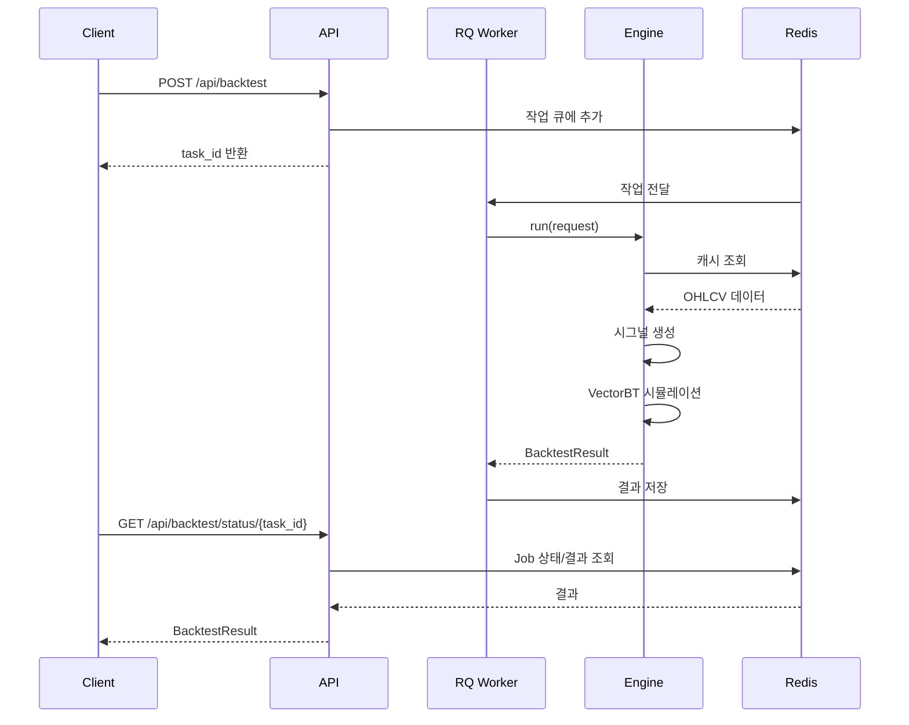

# 백엔드 기능 명세서

> 백테스팅 시스템의 백엔드 아키텍처 및 핵심 로직 문서

---

## 📋 목차

1. [아키텍처 개요](#아키텍처-개요)
2. [핵심 서비스](#핵심-서비스)
3. [데이터 흐름](#데이터-흐름)
4. [기술 지표](#기술-지표)
5. [캐싱 전략](#캐싱-전략)
6. [비동기 처리](#비동기-처리)

---

## 아키텍처 개요

```
┌─────────────┐     ┌─────────────┐     ┌─────────────┐
│   FastAPI   │────▶│    Redis    │────▶│  RQ Worker  │
│   (API)     │     │ (Queue/캐시) │     │ (app.worker)│
└─────────────┘     └─────────────┘     └─────────────┘
                           │
                    ┌──────┴──────┐
                    ▼             ▼
            ┌───────────┐  ┌───────────┐
            │ VectorBT  │  │  Binance  │
            │(Backtest) │  │  (Data)   │
            └───────────┘  └───────────┘
```

### 디렉토리 구조

```
backend/
├── app/
│   ├── main.py              # FastAPI 엔트리포인트
│   ├── rq_app.py            # RQ 큐/Redis 연결 설정
│   ├── worker.py            # RQ 워커 진입점 (Numba 워밍업 후 기동)
│   ├── cron.py              # RQ 크론 진입점 (주기 작업을 큐에 넣음, 항상 1개)
│   ├── tasks/               # 백그라운드 작업 정의
│   │   ├── backtest_tasks.py
│   │   └── cache_tasks.py   # 캔들 캐시 일일 갱신
│   ├── routers/             # API 라우터
│   │   ├── backtest.py      # 백테스트 API
│   │   ├── assets.py        # 자산 API
│   │   └── ai.py            # AI API
│   ├── services/            # 비즈니스 로직
│   │   ├── backtest/        # 백테스트 엔진
│   │   │   ├── engine.py    # 시뮬레이션 실행
│   │   │   ├── analyzer.py  # 결과 분석
│   │   │   └── strategy.py  # 시그널 생성
│   │   ├── data.py          # OHLCV 데이터 수집
│   │   ├── cache.py         # Redis 캐시
│   │   ├── indicators.py    # 기술 지표 계산 함수 (Numba 최적화)
│   │   ├── indicator_registry.py  # 지표 정의 한 곳 (파라미터·출력·표시 방식·템플릿)
│   │   ├── expression.py    # 커스텀 식 (Pine 부분집합) 파서·평가기
│   │   └── scheduler.py     # 캐시 초기화/갱신 함수
│   ├── schemas/             # Pydantic 모델
│   └── core/                # 설정
└── tests/                   # 테스트
```

---

## 핵심 서비스

### 1. BacktestEngine

**역할**: VectorBT 기반 백테스트 시뮬레이션 실행

**위치**: `services/backtest/engine.py`

**주요 메서드**:

| 메서드                       | 설명                              |
| ---------------------------- | --------------------------------- |
| `run(request)`               | 백테스트 전체 실행 (async)        |
| `_calculate_warmup_period()` | 지표 계산을 위한 워밍업 기간 산출 |

**처리 흐름**:

1. Warmup 기간 계산
2. OHLCV 데이터 수집 (warmup 포함)
3. 매수 시그널 생성 + 청산 조건 컴파일 (`ExitConditionSet`)
4. VectorBT `from_order_func` 시뮬레이션 (복리 재투자, 코인별 최소 주문 단위 버림, 익절/손절 판단)
5. 결과 분석 및 반환

---

### 2. StrategyParser

**역할**: 조건 기반 매수/매도 시그널 생성

**위치**: `services/backtest/strategy.py`

**지원 조건 템플릿**:

| 템플릿               | 설명                 | 예시                     |
| -------------------- | -------------------- | ------------------------ |
| `indicator_vs_value` | 지표 vs 값 비교      | RSI < 30                 |
| `indicator_cross`    | 지표 교차            | SMA(20) 상향돌파 SMA(50) |
| `price_cross`        | 가격 교차            | 종가 > EMA(20)           |
| `profit_loss`        | 진입가 대비 익절/손절 | +5% 익절, -3% 손절       |
| `band_touch`         | 밴드 터치            | 볼린저 하단 터치         |
| `macd_signal`        | MACD 시그널          | MACD 골든크로스          |
| `stochastic`         | 스토캐스틱           | %K 과매도                |
| `candle_pattern`     | 캔들 패턴            | 망치형                   |
| `volume`             | 거래량               | 평균 대비 2배            |
| `price_change`       | 가격 변동률          | 전일 대비 +3%            |

조건 사이는 `nextOperator`(AND/OR)로 묶이고 왼쪽부터 차례로 적용됩니다. 우선순위는 없습니다.

**`profit_loss`는 다른 조건과 평가 위치가 다릅니다.** 진입가를 알아야 판단할 수 있는데
진입가는 시뮬레이션을 돌려야 나오므로, 벡터 단계에서 미리 계산할 수 없습니다. 그래서
청산 조건은 `compile_exit_conditions()`가 조건별 배열(`ExitConditionSet`)로 풀어 두고,
시뮬레이션 루프(`engine.order_func_nb`)가 봉마다 현재 포지션의 진입가로 수익률을 계산해
다른 조건과 AND/OR로 합칩니다. 판단은 **전 봉 종가**, 체결은 **이번 봉 시가**로, 다른
조건이 한 칸 밀려 다음 봉 시가에 체결되는 규칙과 같습니다. 그래서 갭이 뜨면 +5% 조건에
+7%로 청산되는 경우가 있습니다. 매수 조건에 들어오면 포지션이 없으므로 항상 False입니다.

---

### 3. ResultAnalyzer

**역할**: 백테스트 결과 분석 및 통계 계산

**위치**: `services/backtest/analyzer.py`

**주요 메서드**:

| 메서드                 | 설명                                   |
| ---------------------- | -------------------------------------- |
| `build_ohlcv()`        | OHLCV 데이터 변환                      |
| `build_trades()`       | 거래 내역 생성 (수수료, 슬리피지 포함) |
| `build_equity_curve()` | 수익 곡선 생성                         |
| `extract_indicators()` | 사용된 지표 데이터 추출                |

---

### 4. DataService

**역할**: OHLCV 데이터 수집 (Binance API + Redis 캐시)

**위치**: `services/data.py`

**데이터 소스 우선순위**:

1. Redis 캐시 조회
2. 캐시 미스 시 Binance API 호출

---

### 5. CandleCache

**역할**: Redis 기반 캔들 데이터 캐싱

**위치**: `services/cache.py`

**캐시 키 형식**: `candle:BTC_USDT:1d`

**갱신 주기**: 매일 00:05 UTC. `rq-cron`이 `maintenance` 큐에 넣고 워커가 실행합니다 (「비동기 처리 › 주기 작업」 참고). 캐시가 비어 있을 때의 초기 적재도 같은 경로로 `rq-cron` 기동 시 한 번 들어갑니다.

---

## 데이터 흐름

### 백테스트 실행 흐름



---

## 지표 레지스트리

지표 하나의 정보는 `services/indicator_registry.py`의 `IndicatorSpec` 하나에 모여 있습니다.
이름, 라벨, 파라미터(기본값·범위), 출력 선(상단/중간/하단, 시그널, 히스토그램 …), 표시
방식(overlay/pane), 고를 수 있는 템플릿, 계산 함수.

나머지는 이 표를 읽습니다. `strategy`는 `spec.compute`로 계산하고(모르는 이름은 즉시
에러), `analyzer`는 `outputs`·`display`로 차트 데이터를 만들고, `ai_strategy`는 enum과
프롬프트 지표 목록을 여기서 뽑고, `GET /api/indicators`가 프론트에 넘깁니다.

**새 지표를 추가하려면** `indicators.py`에 계산 함수 하나, 레지스트리에 항목 하나입니다.
파라미터가 몇 개든 UI·AI·차트가 따라옵니다.

### 커스텀 식 (`services/expression.py`)

레지스트리에 없는 지표는 사용자가 **Pine 문법 부분집합의 식**으로 만들 수 있습니다
(`templateType: "expression"`). 파이썬 `ast`로 파싱해 화이트리스트(위 `ta.*`/`math.*`,
OHLCV 시리즈, 산술·비교·논리, `[n]` 과거 참조) 밖의 노드는 전부 거부하고, pandas
연산으로 직접 평가합니다. **코드 실행이 아니라 식 평가**라 `import`·루프·이름 접근이
불가능합니다. 길이 500자·노드 200개·기간 1000 제한. 검증은
`POST /api/indicators/validate-expression`.

차트 표시용으로 `extract_plot_series()`가 식에서 숫자 부분식(비교 피연산자,
`crossover`/`crossunder` 인자)을 뽑아 평가합니다. `ResultAnalyzer`가 이것을
`type: "expression"` 지표 데이터로 결과에 실어, 프론트가 RSI 선·보조선(비교 상수)을
구조화 조건과 똑같이 그립니다. 가격 스케일 부분식은 overlay, 나머지는 pane.

AI 변환(`ai_strategy`)도 구조화 템플릿으로 표현할 수 없는 전략을 `expression`으로
만듭니다. 프롬프트에 식 문법을 안내하고, 응답의 식을 `validate()`로 전부 검증한 뒤
틀린 식은 오류 문구와 함께 한 번 다시 시킵니다. 재시도까지 실패하면 400.

요청의 지표 파라미터는 `SentenceCondition.params`(교차 상대는 `targetParams`)로 받고, 옛
필드 `indicatorPeriod`/`targetPeriod`는 `params`가 없을 때 첫 파라미터로 해석합니다.

---

## 기술 지표

### 지원 지표 목록

| 지표            | 함수                | Numba 최적화        |
| --------------- | ------------------- | ------------------- |
| RSI             | `rsi()`             | ✅ (`_rma_numba`)   |
| EMA             | `ema()`             | ✅ (`_ema_numba`)   |
| SMA             | `sma()`             | ❌ (pandas rolling) |
| MACD            | `macd()`            | ✅ (EMA 사용)       |
| Bollinger Bands | `bollinger_bands()` | ❌                  |
| Stochastic      | `stochastic()`      | ❌                  |

### TradingView 호환성

모든 지표는 **TradingView Pine Script**와 동일한 계산 방식 사용:

- RSI: ta.rma() 방식 (첫 값은 SMA, 이후 RMA)
- EMA: ta.ema() 방식 (첫 값은 SMA)

---

## 캐싱 전략

### Redis 캐시 구조

```
Redis
├── candle:BTC_USDT:1d     → JSON 배열 (모든 캔들)
├── candle:BTC_USDT:1h     → JSON 배열
├── candle:ETH_USDT:1d     → JSON 배열
└── cache:last_update      → 마지막 업데이트 날짜
```

### 캐시 갱신 스케줄

- **서버 시작 시**: 캐시가 비어있으면 초기화 (2017년~현재)
- **매일 00:05 UTC**: 새 캔들 추가

---

## 비동기 처리

### RQ 설정

| 설정        | 값                    |
| ----------- | --------------------- |
| 큐 이름     | backtest, maintenance (워커는 backtest 우선) |
| 연결        | Redis                 |
| 작업 타임아웃 | 1시간 (`default_timeout=3600`) |
| 워커 기동   | `python -m app.worker` |

워커는 `rq worker` CLI 대신 `app/worker.py`로 띄웁니다. RQ는 작업마다 자식
프로세스를 fork하므로, 워커를 시작하기 전에 Numba JIT 워밍업을 끝내야
자식들이 컴파일 결과를 물려받습니다. CLI로 띄우면 요청마다 약 16초를
다시 컴파일합니다.

### 주기 작업

`app/cron.py`(`rq-cron` 서비스)가 정해진 시각에 작업을 `maintenance` 큐에 넣고
워커가 실행합니다. RQ의 CronScheduler는 리더 선출이 없어서 **이 프로세스는 항상
하나**여야 합니다. 워커 수와는 무관합니다.

| 작업 | 시각 | 함수 |
| ---- | ---- | ---- |
| 캔들 캐시 일일 갱신 | 매일 00:05 UTC (한국 09:05) | `tasks/cache_tasks.update_candle_cache` |

### 작업 상태

```
queued → started → finished / failed
```

진행률은 `job.meta`에 기록하고(`update_job_progress`) 상태 조회 API가 읽어서
`pending / running / completed / failed`로 변환해 응답합니다.

---

## 환경 변수

| 변수              | 설명             | 기본값    |
| ----------------- | ---------------- | --------- |
| `REDIS_HOST`      | Redis 호스트     | redis     |
| `REDIS_PORT`      | Redis 포트       | 6379      |
| `REDIS_PASSWORD`  | Redis 비밀번호   | (없음)    |
| `OPENAI_API_KEY`  | OpenAI API 키    | (필수)    |
| `ALLOWED_ORIGINS` | CORS 허용 도메인 | localhost |
| `SENTRY_DSN`      | Sentry DSN       | (선택)    |

---

## 모니터링

### Prometheus 메트릭

- **엔드포인트**: `GET /metrics`
- **수집 항목**: 요청 수, 응답 시간, 에러율

### Sentry 에러 추적

- FastAPI 에러 자동 전송, RQ 작업 실패는 `sentry_sdk.capture_exception`으로 전송
- 환경변수 `SENTRY_DSN` 설정 시 활성화
